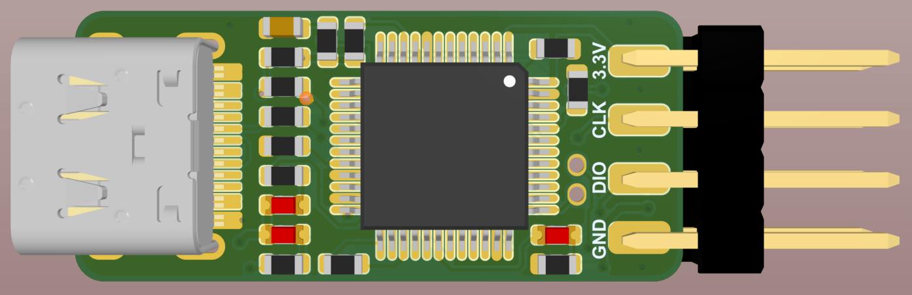

# ST-Link-TypeC

### 概述

1. 基于稚辉君的“ST-LINK-Nano”，主要将其0402的电阻替换成了0603，并重新排版布线，板子体积略有增加。
2. 更换了下载方式，用1.27mm间距的排针口替换掉了原版的跳线，简化布线

参考链接：[peng-zhihui/ST-Link-Nano: 自制超迷你的ST-Link模块。 (github.com)](https://github.com/peng-zhihui/ST-Link-Nano)

### 也记得给这个仓库点点星星~~

